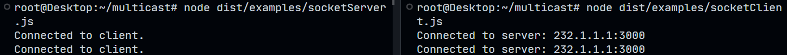

# Multicast

This is just about the tiniest library one could possibly write to discover & broadcast other services on your network in Node.js. I have provided a examples in the `/examples` directory to check out. 

- Basic server / client discovery and logging of their IP addresses + port.
- Server / client discovery and negotiating a websocket connection using Socket.io.

This library is super light weight and not designed for production. It was mostly for a learning experience with DGRAM's.

## Basic Server

"Pseudo-Client" Output

```js
[
  {
    address: '10.0.0.74',
    port: 4123,
    uuid: '14665423-9007-423f-b2e1-69d28f4dc371'
  }
]
```

"Pseudo-Server" Output

```js
[
  {
    address: '10.0.0.151',
    port: 4123,
    uuid: '96f7f287-995d-490c-937f-63c3d4070aee'
  }
]
```

## Socket Discovery

